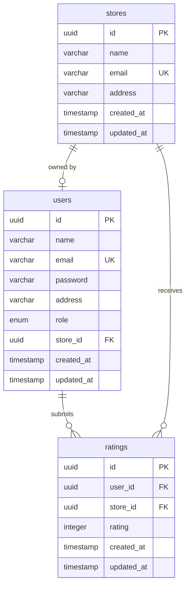

# 🏪 Store Rating Platform

A full-stack role-based web application where users can browse and rate stores registered on the platform. The system supports three user roles (Admin, Normal User, Store Owner) with distinct permissions and functionalities.

## 🌟 Project Overview

This platform enables:
- **Users** to discover and rate stores
- **Store Owners** to monitor their ratings and customer feedback
- **Administrators** to manage the entire platform

Built as a modern, production-ready internship project demonstrating best practices in full-stack development.

## 🛠️ Tech Stack

### Backend
- **Framework**: Express.js (Node.js)
- **Database**: PostgreSQL
- **ORM**: Prisma
- **Authentication**: JWT (JSON Web Tokens)
- **Validation**: express-validator
- **Password Security**: bcryptjs

### Frontend
- **Framework**: React 18
- **Build Tool**: Vite
- **Routing**: React Router DOM v6  
- **HTTP Client**: Axios
- **Styling**: Vanilla CSS with modern design system
- **State Management**: React Context API

## 📋 Database Schema



### Key Features:
- Each user can rate each store only once (unique constraint)
- Store owners are linked to their stores
- Average ratings calculated dynamically
- All data properly normalized

## 👥 User Roles & Permissions

### 🔑 System Administrator
- View dashboard statistics (users, stores, ratings)
- Add and manage stores
- Add admin and normal users
- View detailed user information
- Filter and sort all listings

### 👤 Normal User
- Self-registration and login
- Browse all stores with search
- View store ratings and details
- Submit ratings (1-5 stars)
- Update their own ratings
- Change password

### 🏪 Store Owner
- Login to dedicated dashboard
- View average store rating
- See rating distribution (1-5 stars)
- View all users who rated the store
- Change password

## ✅ Form Validation (Enforced on Both Frontend & Backend)

- **Name**: 20-60 characters, letters and spaces only
- **Email**: Valid email format
- **Password**: 8-16 characters, ≥1 uppercase, ≥1 special character
- **Address**: Maximum 400 characters  
- **Rating**: Integer between 1 and 5

## 🚀 Quick Start

### Prerequisites
- Node.js (v14+)
- PostgreSQL (v12+)
- npm or yarn

### 1. Clone the Repository
```bash
git clone <repository-url>
cd store-rating-platform
```

### 2. Backend Setup

```bash
# Navigate to backend
cd backend

# Install dependencies
npm install

# Configure environment variables
cp .env.example .env
# Edit .env with your PostgreSQL credentials

# Run Prisma migrations
npx prisma generate
npx prisma migrate dev --name init

# Start the backend server
npm run dev
```

Backend will run on `http://localhost:5000`

**Detailed backend instructions**: See [backend/README.md](./backend/README.md)

### 3. Frontend Setup

```bash
# Navigate to frontend (in a new terminal)
cd frontend

# Install dependencies
npm install

# Configure environment (already set by default)
# VITE_API_URL=http://localhost:5000/api

# Start the frontend server
npm run dev
```

Frontend will run on `http://localhost:5173`

**Detailed frontend instructions**: See [frontend/README.md](./frontend/README.md)

### 4. Create First Admin User

Use Prisma Studio or direct SQL:

```bash
cd backend
npx prisma studio
```

Or insert via SQL:
```sql
INSERT INTO users (id, name, email, password, address, role, created_at, updated_at)
VALUES (
  gen_random_uuid(),
  'System Administrator Account',
  'admin@platform.com',
  -- Use bcrypt hash of your desired password
  '$2a$10$YourHashedPasswordHere',
  '123 Admin Street, City, State 12345',
  'ADMIN',
  NOW(),
  NOW()
);
```

## 📁 Project Structure

```
store-rating-platform/
├── backend/                    # Express.js API
│   ├── src/
│   │   ├── config/            # Database configuration
│   │   ├── controllers/       # Request handlers
│   │   ├── middleware/        # Auth, validation, error handling
│   │   ├── routes/            # API routes
│   │   ├── services/          # Business logic
│   │   └── utils/             # Helper functions
│   ├── prisma/
│   │   └── schema.prisma      # Database schema
│   └── README.md
│
├── frontend/                   # React application
│   ├── src/
│   │   ├── api/               # API integration
│   │   ├── components/        # Reusable components
│   │   ├── context/           # Global state
│   │   ├── hooks/             # Custom hooks
│   │   ├── pages/             # Page components
│   │   ├── styles/            # CSS files
│   │   └── utils/             # Helper functions
│   └── README.md
│
└── README.md                   # This file
```

## 🔌 API Endpoints

### Authentication
- `POST /api/auth/signup` - User registration
- `POST /api/auth/login` - Login (all roles)
- `PUT /api/auth/password` - Update password

### Admin (Protected)
- `GET /api/admin/dashboard` - Statistics
- `GET /api/admin/stores` - List stores
- `POST /api/admin/stores` - Add store with owner
- `GET /api/admin/users` - List users  
- `POST /api/admin/users` - Add user/admin
- `GET /api/admin/users/:id` - User details

### User (Protected)
- `GET /api/user/stores` - Browse stores
- `POST /api/user/ratings` - Submit rating
- `PUT /api/user/ratings/:id` - Update rating
- `GET /api/user/ratings/my` - My ratings

### Store Owner (Protected)
- `GET /api/store/dashboard` - Store analytics
- `GET /api/store/ratings` - All ratings

**Full API documentation**: See [backend/README.md](./backend/README.md)

## 🎨 UI Screenshots & Features

### Modern Design System
- 🎨 Gradient backgrounds (indigo → purple)
- 🌓 Clean card-based layouts
- ⚡ Smooth transitions and animations
- 📱 Fully responsive (mobile, tablet, desktop)
- 🎯 Role-based navigation

### Key Features
- Real-time form validation with hints
- Loading states for all async operations
- Error handling with user-friendly messages
- Protected routes by role
- Auto-redirect after login based on role
- Intuitive dashboards for each role

## 🔒 Security Features

- ✅ JWT-based authentication
- ✅ Password hashing (bcrypt with 10 salt rounds)
- ✅ Role-based access control
- ✅ Protected API routes
- ✅ Input validation (frontend + backend)
- ✅ SQL injection protection (Prisma ORM)
- ✅ CORS configuration
- ✅ Auto-logout on token expiration

## 📊 Testing

### Manual Testing Flow

1. **Sign up as a user** at `/signup`
2. **Browse stores** and submit ratings
3. **Create admin** via database/Prisma Studio
4. **Login as admin** to view dashboard
5. **Add stores** (automatically creates store owners)
6. **Login as store owner** to view analytics

### API Testing
- Use Postman or Thunder Client
- Import endpoints from backend README
- Test authentication and authorization

## 🚀 Deployment

### Backend Deployment
- Deploy to platforms like Heroku, Railway, or Render
- Set environment variables
- Configure production database
- Enable SSL for database connections

### Frontend Deployment
- Deploy to Vercel, Netlify, or similar
- Set `VITE_API_URL` to production backend URL
- Configure SPA routing

### Database
- Use managed PostgreSQL (Supabase, Neon, AWS RDS)
- Enable connection pooling
- Regular backups

## 💡 Scalability Suggestions

### Immediate Improvements
1. **Pagination**: For store and user lists
2. **Email Verification**: On signup
3. **Password Reset**: Via email
4. **Profile Pictures**: For users and stores
5. **Rich Reviews**: Text reviews alongside ratings
6. **Store Categories**: Better filtering

### Advanced Features
1. **Analytics Dashboard**: Charts and insights
2. **Notifications**: Email/in-app for new ratings
3. **Search**: Full-text search (Elasticsearch)
4. **Rate Limiting**: Prevent API abuse
5. **Caching**: Redis for frequently accessed data
6. **CDN**: For static assets
7. **Microservices**: Split by domain at scale

### Infrastructure
1. **Database Indexing**: On frequently queried columns
2. **Connection Pooling**: For high traffic
3. **Horizontal Scaling**: Stateless JWT enables this
4. **Message Queues**: For async operations
5. **Monitoring**: Error tracking and performance

## 📝 Development Notes

- Backend follows RESTful API design principles
- Frontend uses Component composition patterns
- Separation of concerns (services, controllers, routes)
- Reusable components and utilities
- Type-safe database queries with Prisma
- Environment-based configuration

## 🎓 Learning Outcomes

This project demonstrates:
- Full-stack development with modern tools
- RESTful API design and implementation
- Database design and relationships
- Authentication and authorization
- Role-based access control
- Form validation (client + server)
- State management in React
- Responsive UI design
- Error handling and security best practices

## 📞 Support & Contributing

For questions or issues:
1. Check the backend/frontend READMEs
2. Review the implementation plan
3. Inspect the database schema
4. Test API endpoints with examples provided

## 📜 License

This project is created for educational purposes as an internship assignment.

## 👨‍💻 Author

Built with ❤️ as a full-stack internship project demonstrating modern web development practices.

---

**🎉 Happy Coding!**
