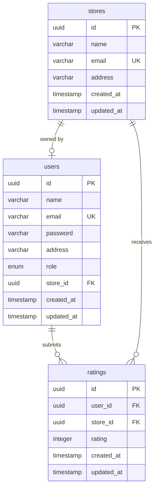

# 🏪 Store Rating Platform

A full-stack role-based web application where users can browse and rate stores registered on the platform. The system supports three user roles (Admin, Normal User, Store Owner) with distinct permissions and functionalities.

## 🌟 Project Overview

This platform enables:
- **Users** to discover and rate stores
- **Store Owners** to monitor their ratings and customer feedback
- **Administrators** to manage the entire platform

Built as a modern, production-ready internship project demonstrating best practices in full-stack development.

## 🛠️ Tech Stack

### Backend
- **Framework**: Express.js (Node.js)
- **Database**: PostgreSQL
- **ORM**: Prisma
- **Authentication**: JWT (JSON Web Tokens)
- **Validation**: express-validator
- **Password Security**: bcryptjs

### Frontend
- **Framework**: React 18
- **Build Tool**: Vite
- **Routing**: React Router DOM v6  
- **HTTP Client**: Axios
- **Styling**: Vanilla CSS with modern design system
- **State Management**: React Context API

## 📋 Database Schema



### Key Features:
- Each user can rate each store only once (unique constraint)
- Store owners are linked to their stores
- Average ratings calculated dynamically
- All data properly normalized

## 👥 User Roles & Permissions

### 🔑 System Administrator
- View dashboard statistics (users, stores, ratings)
- Add and manage stores
- Add admin and normal users
- View detailed user information
- Filter and sort all listings

### 👤 Normal User
- Self-registration and login
- Browse all stores with search
- View store ratings and details
- Submit ratings (1-5 stars)
- Update their own ratings
- Change password

### 🏪 Store Owner
- Login to dedicated dashboard
- View average store rating
- See rating distribution (1-5 stars)
- View all users who rated the store
- Change password

## ✅ Form Validation (Enforced on Both Frontend & Backend)

- **Name**: 20-60 characters, letters and spaces only
- **Email**: Valid email format
- **Password**: 8-16 characters, ≥1 uppercase, ≥1 special character
- **Address**: Maximum 400 characters  
- **Rating**: Integer between 1 and 5

## 🚀 Quick Start

### Prerequisites
- Node.js (v14+)
- PostgreSQL (v12+)
- npm or yarn


## 📁 Project Structure

```
store-rating-platform/
├── backend/                    
│   ├── src/
│   │   ├── config/            
│   │   ├── controllers/       
│   │   ├── middleware/        
│   │   ├── routes/            
│   │   ├── services/         
│   │   └── utils/             
│   ├── prisma/
│   │   └── schema.prisma      
│   └── README.md
│
├── frontend/                   
│   ├── src/
│   │   ├── api/               
│   │   ├── components/        
│   │   ├── context/           
│   │   ├── hooks/             
│   │   ├── pages/             
│   │   ├── styles/            
│   │   └── utils/             
│   └── README.md
│
└── README.md                   
```

## 🔌 API Endpoints

### Authentication
- `POST /api/auth/signup` - User registration
- `POST /api/auth/login` - Login (all roles)
- `PUT /api/auth/password` - Update password

### Admin (Protected)
- `GET /api/admin/dashboard` - Statistics
- `GET /api/admin/stores` - List stores
- `POST /api/admin/stores` - Add store with owner
- `GET /api/admin/users` - List users  
- `POST /api/admin/users` - Add user/admin
- `GET /api/admin/users/:id` - User details

### User (Protected)
- `GET /api/user/stores` - Browse stores
- `POST /api/user/ratings` - Submit rating
- `PUT /api/user/ratings/:id` - Update rating
- `GET /api/user/ratings/my` - My ratings

### Store Owner (Protected)
- `GET /api/store/dashboard` - Store analytics
- `GET /api/store/ratings` - All ratings

**Full API documentation**: See [backend/README.md](./backend/README.md)

## 🎨 UI Screenshots & Features

### Modern Design System
- 🎨 Gradient backgrounds (indigo → purple)
- 🌓 Clean card-based layouts
- ⚡ Smooth transitions and animations
- 📱 Fully responsive (mobile, tablet, desktop)
- 🎯 Role-based navigation

### Key Features
- Real-time form validation with hints
- Loading states for all async operations
- Error handling with user-friendly messages
- Protected routes by role
- Auto-redirect after login based on role
- Intuitive dashboards for each role

## 🔒 Security Features

- ✅ JWT-based authentication
- ✅ Password hashing (bcrypt with 10 salt rounds)
- ✅ Role-based access control
- ✅ Protected API routes
- ✅ Input validation (frontend + backend)
- ✅ SQL injection protection (Prisma ORM)
- ✅ CORS configuration
- ✅ Auto-logout on token expiration

